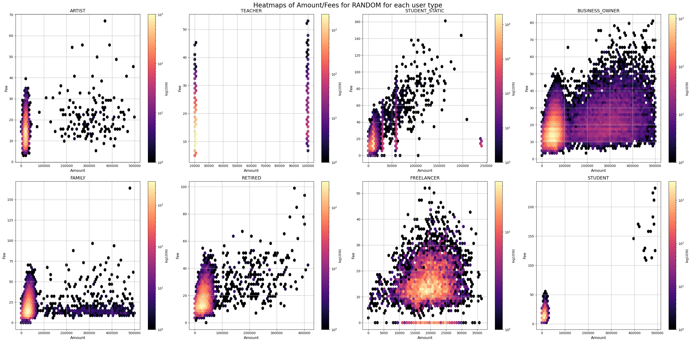
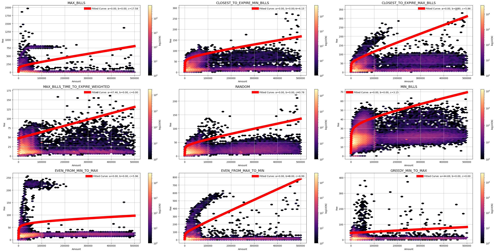
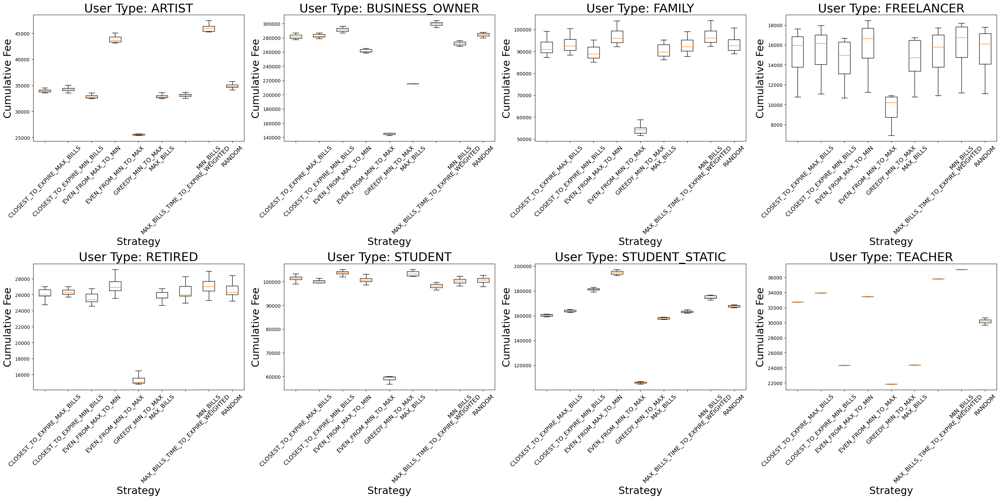

# Coin Selection for GNU Taler Wallets


## Overview
This repository contains the implementation of a coin selection simulation and analysis developed specifically to simulate the 
actions and transactions as part of the [GNU Taler project](https://taler.net/en/index.html), a free software payment system. 
The focus of this module is to find efficient strategies for selecting coins from a user's wallet for payments, 
optimizing various aspects such as the number of coins, their validity, and associated fees.

This project aims to provide a comprehensive toolkit for analyzing different coin selection strategies under various 
user behaviors and transaction patterns. By simulating real-world usage scenarios, the module helps in understanding the 
impact of different strategies on transaction efficiency and cost, ensuring that the GNU Taler system can offer optimal 
performance and minimal fees to its users.


## Features
- Implements coin selection algorithms in C for high efficiency and performance.
- Simulates wallet behaviors with varying user profiles and transaction patterns.
- Applies heuristics based on coin attributes for transaction efficiency.
- Includes a model to calculate transaction fees given a specific fee structure.
- Generates a Stephan curve approximation to represent the fee distribution for each strategy.

## Getting Started
Download the project directory with coin-selection-c and coin-selection-analysis in one folder.

Example:
```
coin-selection
  |- coin-selection-c
  |- coin-selection-analysis
```
Code to launch the program and run simulations.
Go to the directory of 'coin-selection-c' and run the following command:
```bash
mkdir build
cd build
cmake ..
make
./coin_selection_c
```

Code to go through the simulation results and analyze the data.
Go to the directory of 'coin-selection-analysis' and run the following command:
```bash
brew install python
pip install jupyter
jupyter notebook
```
After the new page with python notebook opens, run the code in the notebook to analyze the data.

### Prerequisites
- 2 projects: coin-selection-c and coin-selection-analysis
- C:
  - CMake (3.22 or higher)
  - C Compiler (C17)
- Python:
  - Python 3.7 or higher
  - Pandas
  - Matplotlib
  - Numpy
  - Scipy
  - Jupyter

## Algorithms
Description of the heuristics and strategies implemented for coin selection.

### Parsing denomination wallet
Our code focuses on supporting basic `keys.json` description files that is provided by `GNU Taler` system,
as such examples you can find next:
1. [Bitcoin](https://bitcoin.ice.bfh.ch/keys)
2. [Stater](https://exchange.taler.grothoff.org/keys)
3. [KUDOS](https://exchange.demo.taler.net/keys)
4. [CHF](https://exchange.chf.taler.net/keys)

Or simply in the file `data/keys.json` in the root of the project. The usage of this file structure is defined in the
`src/main.c` file. But as demands could be different we also provide support to parsing of the file with the structure
as defined in the `data/taler.conf` file.

As result of parsing, we will receive next structure:
```
Wallet
├── coins: [Coin]
│   ├── Coin 1
│   │   ├── uniqueId: long long
│   │   ├── denomination: Denomination
│   │   │   ├── name: char*
│   │   │   ├── amount: long long
│   │   │   └── rules: Rules
│   │   │       ├── rsa_keysize: int
│   │   │       ├── cipher: char*
│   │   │       ├── fees: Fees
│   │   │       │   ├── deposit_fee: Fee
│   │   │       │   │   ├── fee_satoshis: long long
│   │   │       │   │   └── percentage_fee: float
│   │   │       │   ├── refund_fee: Fee
│   │   │       │   │   ├── fee_satoshis: long long
│   │   │       │   │   └── percentage_fee: float
│   │   │       │   ├── withdraw_fee: Fee
│   │   │       │   │   ├── fee_satoshis: long long
│   │   │       │   │   └── percentage_fee: float
│   │   │       │   └── refresh_fee: Fee
│   │   │       │       ├── fee_satoshis: long long
│   │   │       │       └── percentage_fee: float
│   │   │       └── durations: Durations
│   │   │           ├── legal: Duration
│   │   │           │   └── time: long long
│   │   │           ├── deposit: Duration
│   │   │           │   └── time: long long
│   │   │           └── withdraw: Duration
│   │   │               └── time: long long
│   │   └── creation_timestamp: time_t
│   ├── ...
│   ...
├── num_coins: int
└── global_fees: GlobalFees
    ├── wire_fee: Fee
    │   ├── fee_satoshis: long long
    │   └── percentage_fee: float
    └── closing_fee: Fee
        ├── fee_satoshis: long long
        └── percentage_fee: float
```

#### Adjustments to work with percentage_fee
If we compare the existing structure of the `keys.json` file and the structure provided upper we can see, that the Coin also contains the 
field of percentage_fee, this field is used to cover the next problem. If the task of the system will be to opperate in the real world, 
as replacement of the credit card system,
some countries might require the fee which based on the amount of transaction and will be 0.03-0.09%. To handle this 
the code must be adjusted, to also parse this values from the description file. To do this the functions which are parsing the values must be modified.
Which include in case of json file the `parse_wallet_config_json()` function in the `src/parser.c` file, and in case 
of the `taler.conf` file the `parse_coin_block()` function in the same file. You must include the parsing of the percentage_fee with the keys
as you have defined them in your description file.
After that you must adjust the function `simulate_user_actions()` in the `src/simulation.c` file, 
to use the percentage_fee in the calculation of the fee (most probably you will be looking for line 108).

### Heuristic Strategies
Several strategies are applied to determine the optimal selection of coins for a given payment, each with its unique rationale and approach:

- **MAX_BILLS**: This strategy selects coins with the highest denominations first, reducing the number of coins used in transactions. It's useful for minimizing the coin count but may not be efficient for expiration management.

- **MIN_BILLS**: Opposite to MAX_BILLS, this strategy starts with the smallest denominations. It helps to use up coins that might be too small to be useful on their own for larger transactions.

- **CLOSEST_TO_EXPIRE_MIN_BILLS**: Prefers coins that are closest to expiration, starting with the smallest denominations. This strategy aims to reduce the likelihood of coins expiring and incurring refresh fees.

- **CLOSEST_TO_EXPIRE_MAX_BILLS**: Similar to the previous strategy but starts with the largest denominations. It balances the use of large denominations while still prioritizing coins close to expiration.

- **MAX_BILLS_TIME_TO_EXPIRE_WEIGHTED**: A refined approach where coins are selected based on a weighted score that considers both the denomination and time to expire. The strategy attempts to balance the monetary value and the urgency of coin usage, providing a middle ground between the MAX_BILLS and CLOSEST_TO_EXPIRE strategies.

- **RANDOM**: Coins are selected at random. This strategy provides a baseline for comparison with other more deterministic strategies.

- **EVEN_FROM_MIN_TO_MAX**: Selects coins evenly starting from the smallest denomination to the largest. This strategy ensures a more uniform use of all denominations in the wallet.

- **EVEN_FROM_MAX_TO_MIN**: Selects coins evenly starting from the largest denomination to the smallest. It aims to balance the use of high and low denominations.

- **GREEDY_MIN_TO_MAX**: A greedy strategy that selects coins to get as close as possible to the desired amount without exceeding it, starting from the smallest denomination.

### Add new strategy
Steps:
1. Add a name of the strategy to the enum in the file `include/coin_selection.h` before the `NUMBER_OF_STRATEGIES`.
2. Add a related name in the files `src/simulation.c` and `src/generator.c`.
3. In the code of the file `src/coin_selection.c` add a new function with the name of the strategy, and define the case in the
function of `allocate_coins_for_deposit()`.
4. And voilà, the new strategy is added.

## Simulation
Explanation of the user behavior modeling and time change simulation.

### User Profiles
Each user type exhibits unique transaction patterns and behaviors that influence how the coin selection strategies perform. The following profiles have been implemented:

- **STUDENT**:
  **Actions**:
    1. Monthly top-up of the wallet, simulating stipend or part-time job earnings, typically ranging from a set minimum to a maximum amount.
    2. Daily transactions representing small purchases, ranging from 1 to 5 transactions a day. Amounts are randomized within a typical student budget.
    3. Occasional refunds representing returns or cancellations of purchases.

- **BUSINESS_OWNER**:
  **Actions**:
    1. Daily multiple deposits simulating various business incomes, each potentially varying significantly in amount.
    2. Multiple withdrawals daily, representing business expenses, with a higher transaction frequency and amounts than other user types.
    3. Large, infrequent transactions simulating capital expenditures or business investments.

- **RETIRED**:
  **Actions**:
    1. Regular monthly pension deposits, with the amount reflecting a typical retirement fund distribution.
    2. Steady withdrawals for living expenses, occurring with predictable regularity but with amounts that may vary based on monthly needs.
    3. Less frequent, larger transactions that could represent medical expenses, travel, or gifts to family members.

- **FAMILY**:
  **Actions**:
    1. Regular monthly deposits reflecting a typical salary or family income.
    2. Daily transactions for household expenses with a varied number of transactions (from 2 to 6) and amounts that reflect the cost of living for a family.
    3. Periodic large withdrawals simulating mortgage or rent payments, tuition fees, or significant purchases such as appliances or vehicles.

- **FREELANCER**:
  **Actions**:
  1. Irregular income reflecting the variable nature of freelance work, with occasional large payments.
  2. Regular daily expenses, smaller in amount but consistent.
  3. Periodic large expenses simulating equipment purchases, software licenses, or other professional investments.

- **TEACHER**:
  **Actions**:
  1. Monthly salary deposits reflecting a steady income.
  2. Daily small expenses, simulating regular purchases like supplies or meals.
  3. Occasional larger expenses representing professional development or educational resources.

- **ARTIST**:
  **Actions**:
  1. Irregular income from art sales or commissions, reflecting the unpredictable nature of an artist’s earnings.
  2. Regular expenses for art supplies, with the amount varying daily.
  3. Periodic large expenses simulating costs for exhibitions, materials, or studio rent.
  4. Occasional grants or awards representing significant income events.

For each user profile, the following additional behaviors are also simulated:

- **Renewals**: Periodic actions to renew coins that are nearing their expiration, incurring fees according to the coin selection strategy in place.
- **Randomness**: To simulate real-life unpredictability, random events are introduced, such as receiving a refund or bonus, facing an unexpected expense, or changing spending habits.

The simulations are crafted to create a realistic spectrum of user behavior, reflecting the diversity of transaction patterns and their impact on the efficacy of different coin selection strategies.

### Time Simulation
When generating the user profilies, for each action description we additionally add the timestamp of this action.
This allows us to simulate the time change and the expiration of coins.

### Add new user
Steps:
1. Add a new user type to the enum `type` in the file `include/user.h` before the `NUMBER_OF_USERS`, and add a function
   annotation `void generate_actions_for_NEW_USER_TYPE(Action **actions, int *size, int days)`;
2. In the file `src/simulation.c` add a new string to the variable of `TypeNames` in the function `simulate_user_actions()` with the name of the user type.
3. In the file `src/generator.c` in the function `generate_user_actions()` add a new case with the name of the user type and call the function `generate_actions_for_NEW_USER_TYPE()`.
4. Finally, go to the file `src/user.c` and create the function of the generation of user actions, as example analyse the existing functions.
5. And voilà, the new user type is added.

## Stefan Curve Approximation

Starting from this part all results was generated by the python code 
in the coin-selection-analysis folder.

### Definition
The Stefan curve is the curve with the formula of

fee = a + b * amount + c * log(amount)

### Curve Fitting
The fitting is made in a such way that we take the 99% of the data
and try to fit the curve to it.

## Results and Analysis
In this section we will present the main results of the simulation and it's analysis that was made for a 100 different users.


### Curve fitting results
The resulted parameters for the Stefan curve approximation for each strategy.

| Strategy                           |    a  |  b  |    c  |
|------------------------------------|-------|-----|-------|
| MAX_BILLS                          |  0.00 | 0.0 | 17.58 |
| CLOSEST_TO_EXPIRE_MIN_BILLS        |  0.00 | 0.0 |  6.15 |
| CLOSEST_TO_EXPIRE_MAX_BILLS        |  0.00 | 0.0 |  5.86 |
| MAX_BILLS_TIME_TO_EXPIRE_WEIGHTED  | 47.46 | 0.0 |  0.00 |
| RANDOM                             |  0.00 | 0.0 |  3.78 |
| MIN_BILLS                          |  0.00 | 0.0 |  3.15 |
| EVEN_FROM_MIN_TO_MAX               |  0.00 | 0.0 |  5.96 |
| EVEN_FROM_MAX_TO_MIN               |  0.00 | 0.0 |  8.99 |
| GREEDY_MIN_TO_MAX                  | 44.69 | 0.0 |  0.00 |

Check for the compliance with the task to predict the 99% of the cases.

| Strategy/<br/>results | MAX BILLS   | CLOSEST TO EXPIRE MIN BILLS | CLOSEST TO EXPIRE MAX BILLS | MAX_BILLS TIME TO EXPIRE WEIGHTED | RANDOM      | MIN BILLS     | EVEN FROM MIN TO MAX | EVEN FROM MAX TO MIN | GREEDY MIN TO MAX |
|--------------------|-------------|-----------------------------|-----------------------------|------------------------------------|-------------|---------------|-----------------------|-----------------------|-------------------|
| Points Above       | 1249 0.51%  | 1551 0.64%                  | 1030 0.42%                  | 1633 0.67%                         | 1063 0.44%  | 2560 1.05%    | 813 0.33%             | 1193 0.49%            | 924 0.38%        |
| Points Below       | 241560 99.49%| 241258 99.36%               | 241779 99.58%               | 241176 99.33%                      | 241746 99.56%| 240249 98.95% | 241996 99.67%         | 241616 99.51%         | 241885 99.62%    |
| Total Points       | 242809      | 242809                      | 242809                      | 242809                             | 242809      | 242809        | 242809                 | 242809                 | 242809           |

### Analysis discussion
In this section we will overview is the simulation is correct and extensive, and compare the results of the different strategies.

#### Simulation results overview
From the next figure we can see that in the simulation we have different user types and for each of these user types we 
have different amounts their distribution, and also the fees that they generate is also diffrent.

All of this could mean that the simulation is correct and extensive.


#### Strategy comparison
For this we will overview 2 main results:
1) The amount/fee plot for each strategy.
2) The cumulative fee comparison for user.

##### Amount/fee plot
From the next figure we cans see that the MAX_BILLS strategy has the biggest number of the points with huge fees.
Other findings authors of this project propose to be discovered by the reader.

##### Cumulative fee comparison
From the next figure we can see that the best strategy in terms of cumulative fees is the GREEDY_MIN_TO_MAX strategy.
But what is also intresting that for the method of EVEN_FROM_MAX_TO_MIN the cumulative fees could be one of the best as for
user type Teacher, but also could be one of the worst as for user type STUDENT_STATIC, which means that even if the strategy is the best in some case,
it might not be the best overall, and possibly to user we can propose different strategies, ideally based on their behavior history, 
but only if such is available.


## Authors
- Bohdan Potuzhnyi
- Vlada Svirsh

## License
СС-BY 4.0

